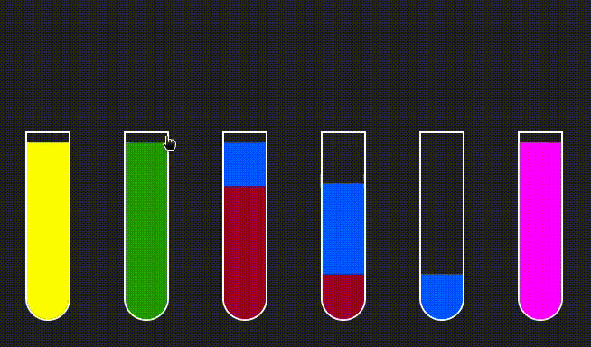

# JS Liquid Filter

Try to sort the colored liquid in the glasses until all colors in the same glass. A challenging yet relaxing game to exercise your brain!

- Tap any glass to pour liquid to another glass.
- The rule is that you can only pour the liquid if it is linked to the same color and there’re enough space on the glass.

## Live Link

click this [link](https://js-liquid-filter.netlify.app/) to try it out.

## Built With

- HTML
- CSS
- JAVASCRIPT
- WEBPACK

## Getting Started

start by cloning the repository.

`git clone git@github.com:rachidelaid/js-liquid-filter.git`

cd to the folder.

`cd js-liquid-filter`

install all the dependencies.

`npm install`

run the live server

`npm run start`

go to [http://localhost:8080](http://localhost:8080)

build the distribution folder before hosting the app

`npm run build`

after the build you can host the `dist` folder.

## Authors

👤 **Rachid El aid**

- GitHub: [@rachidelaid](https://github.com/rachidelaid)
- Twitter: [@rachidelaid1](https://twitter.com/rachidelaid1)
- LinkedIn: [Rachid El aid](https://www.linkedin.com/in/rachid-elaid-106336203/)

## 🤝 Contributing

Contributions, issues, and feature requests are welcome!

Feel free to check the [issues page](../../issues/).

## Show your support

Give a ⭐️ if you like this project!
